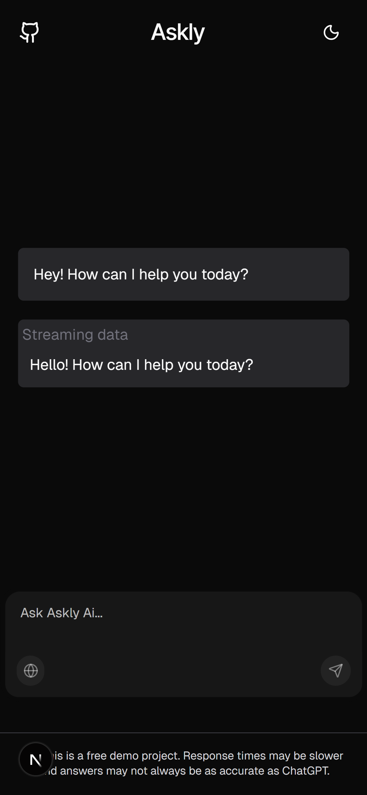
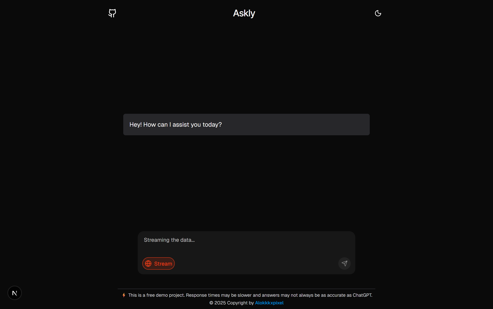

🤖 Askly AI – Chat App

Askly AI is a full-stack AI-powered chat application built with Next.js 14, ShadCN/Skiper UI components, and integrated with OpenAI API for generating intelligent responses.

The app is fully responsive, supports dark & light themes, and demonstrates real-time streaming responses from AI.

✨ Features

⚡ AI Chat Responses – Powered by OpenAI API.

🎨 Beautiful UI – Built with Skiper UI (ShadCN + Tailwind).

🌗 Dark/Light Theme Toggle (System-based or manual switch).

📱 Fully Responsive – Works seamlessly across devices (mobile, tablet, desktop).

🔄 Streaming Support – View live AI responses as they are generated.

🆓 Free Demo – Response speed may vary and accuracy is not identical to ChatGPT.

🖼️ Screenshots
📱 Mobile View

💻 Desktop View

